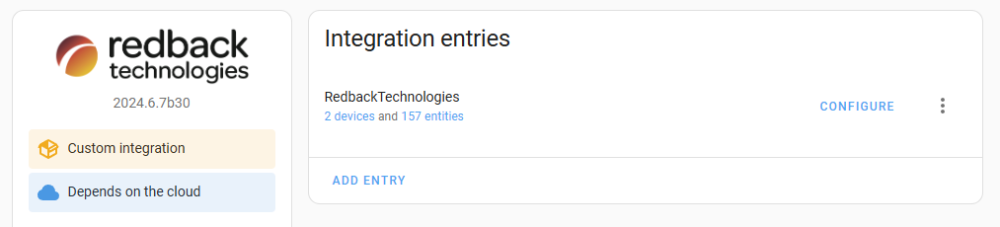
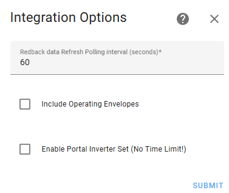

<h1 align="center">
  
   
  <i>Redback Smart Inverters Home Assistant Integration</i>
   
  <h3 align="center">
    <i> Custom Home Assistant component for controlling and monitoring Redback Technologies Smart Inverters. </i>
     
  </h3>
</h1>

  <href="https://github.com/cabberley/HA_RedbackTech/releases">
   
   
 

    

  

[Redback Technologies](https://redbacktech.com/) produces a range of inverter and battery systems. This integration uses the Redback Technologies Portal (public API) and portal (portal.redbacktech.com) to sync and control your solar and battery energy data with Home Assistant.

> [!IMPORTANT]
> **Please make sure you read and understand the information below on how this integration controls your inverter!**

This release of the integration adds some enhancements!!
**This Integration is the only way I know of to curtail your Redback Exports to avoid negative Feed in Tariffs**

## This HACS Integration for Redback Technologies Enables you to manage your Redback system

- You can curtail your Redback to avoid Negative FIT - using Operating Envelopes!
- Supports multiple API Accounts
- Supports multiple RedBack inverters on the same site
- Supports multiple inverters on the same API Account
- Supports setting up Schedules to manage your Inverter's operations at defined times and durations
- Supports and Creates Operating Envelopes. Refer to the wiki to find out more and understand what Operating Envelopes are!!
- Creates an Inverter and a Battery devices for each inverter it finds (Adds the Battery device only if it finds batteries in your setup)

## Version 2.7.0 updates

- Added Configuration Option to display schedules and Envelopes in Home Assistant Calendars.
- If you enable calendar option, you can delete a schedule or operating envelope directly from the calendar!
- Added a few more sensors to display more detail on the MPPT strings if it is available.
- Code cleanups as well.
- Couple of bug fixes

## Version 2.6.7 updates

- Added support for Operating Envelopes, after loading the integration go to the Integration and select configure, and check the box to enable the device. Refer to the wiki for more details.
- Fixed the Integration configuration flows. You can now correctly reconfigure the integration.
- Code optimizations, including using the correct Redback API authentication endpoints.
- Security, now uses correct OAuth2 Redback API authentication.

## Version 2.6.6 updates

- Added full Inverter Control via Portal via Call Services only. 'set_portal_mode' services
- Modified Schedule select list to Display datetime and PowerMode for the scheduled events
- Added new sensor to display % power generation of your PV capacity, not inverter capacity
- Added better support for the RedBack SI series Inverters, removed buttons for inverter as they aren't relevant
- Optimization of API calls to reduce unnecessary API calls

## Version 2.6.5 updates

- fixed an URGENT issue with Token expiration logic prematurely timing out and renewing the token, was causing HTTP 500 errors sproadicly.
- fix to support Redback SI series inverters, was crashing the device creation process due to them not using the historical 'Schedule APIs'

## Version 2.6.3 updates

- Added new sensors to display information about currently active scheduled event
- Added Services to enable calling several functions
  - Reset to AUTO Mode
  - Delete All Scheduled Events
  - Create a scheduled Event

## Pre-requisites

You need to contact Redback Technologies support team to request API access. This appears to be available to any customer who asks. You will receive access details including "Client ID" and "Client_Secret" which are necessary for this integration.

You will also need your username(email) and password for the Redback Portal Website as well.

## Installation

To install this Home Assistant Custom Integration, either Click on the open HACS Repository or by manually copying the `custom_components/redback_tech` folder into your Home assistant `custom_components` folder.

> [!TIP]
> Don't forget to restart your Home Assistant after adding the integration to your HACS!

## Configuration

After adding the Integration to HACS go to your settings and add the Integration.
Complete the form and submit.

- Redback API Client_ID
- Redback Client_Secret
- Redback Portal Email address
- Redback Portal Password

If successful you should now find devices for all your Inverters and Battery stacks.

### Additional configuration options/steps

After your initial integration setup is complete, there are several optional settings you can enable. If navigate to the Device screen as soon below and click on Configure, an options dialog will pop up.

The current options available are:

- Refresh Polling: Adjusting the default 60 seconds between updates. DO NOT SET THIS BELOW 60 seconds. The Redback Inverters only update once every 60 seconds.
- Include Operating Envelopes: This will add a new Site level device for managing Redback Operating Envelopes. Refer tot he WIKI topic to understand more.
- Enable Portal Inverter Set: This adds an additional button to your Inverter Device, that can set the Mode and Power level without a time limit.
  

Make your changes and then submit, the integration will reload with the new options.

>[!TIP]
>If you deselect an option previously enabled, the associated device for operating envelope or button for Enable Portal Inverter set will still show up on your system, you need to delete them afterwards to remove them completely from your setup.

## Controlling your Inverter with the Integration

> [!TIP]
> People with Redback SI series smart Inverters won't have access to the Controlling your Inverter through this integration atm. I do plan to provide an interrface to the 'Relay' scheduler when time permits.

Most users will be familiar with the Redback Portal Settings Page, which enables you to either create timed schedule to set the inverter to operate during a window of time or the alternative of set the Inverter to a mode and power setting and it will stay like that until you change it.

For this integration, I decided to take the schedule path, the reasoning for this was my previous controls to set the inverter using the 'Set" method relied on HA setting a date time value to a DateTime entity and triggering a HA event to turn it back to Auto when the time triggered. If HA restarted, there was no guarantee that the datetime value would persist and the trigger would fire when expected.

This integration, uses the scheduling so the Redback System will return its state after the 'Window' has completed. This also enables you to set schedules in advance to meet your desired inverter\battery power flows. You could integrate with [EMHASS](https://github.com/davidusb-geek/emhass) to setup a set off predefined schedules.

### The Redback Integration Controls

On the Inverter Device are a set of controls
**Scheduled ID Selection**
If you have any "scheduled events" (Scheduled inverter control periods) this selector will provide a list of the current schedules sitting in the Redbacks systems. When you select one from this list the following sensors will refresh with the details of this schedule

- Scheduled Start Time
- Scheduled Finish Time
- Scheduled Duration (minutes between start and finish)
- Scheduled Inverter Mode (Charge Battery, Discharge Battery, Import, Export, Conserve)
- Scheduled Power Level (power in Watts)

**Schedule Creation Fields**
The following fields enable you to set the parameters to create a scheduled event

- Power Mode Selection (Set the Inverter Mode for the Event)
- Set Power Level (Set the Power level in Watts for the Event)
- Set Duration (Set the number of minutes that this event should run for)
- Set Start Time (Date time entity to set the start time for the event)

After you have set those parameters, press the **Create Schedule** button and the integration will send the data to Redback to add onto your schedule. After a few seconds the unique ID Redback assigned the event will become visible in the Scheduled ID Selection Selector.

**Operation Envelope Fields**
The following fields enable you to set the parameters to create an Operating Envelope (refer to the [wiki for more information on Operating Envelopes](https://github.com/cabberley/HA_RedbackTech/wiki/Creating-an-Operating-Envelope))

- Set Start Time (The data and time that the schedule should start)
- Set End Time (The data and time that the schedule should Stop)
- Set Envelope Name (Each Envelope needs a unique name. Don't I append a random 6 alpha numeric characters to the end to ensure uniqueness)
- Set Max fields (The value for each aspect of the envelope that you want to create)

After setting those parameters press the **Create Envelope** button and the integration will send the Operating Envelope to Redback.

> [!NOTE]
> If you want to change the mode of the inverter immediately for a period of time, just set the start time to now, along with the other settings desired and press the **create Schedule** button.
> To help I have added a Button "Reset Start Time to Now' to set the time to the current time.

> [!IMPORTANT]
> When creating a schedule, don't rush it as the system needs to update the data for each field. 

### The Redback Integration Buttons

On the Inverter Device are a set of buttons

- Create Schedule (Explained above)
- Delete All Schedules (This will delete all events in the system and return to the inverter to the mode it was in before the any current occurring events)
- Delete Selected Schedule (Deletes only the event selected in the Selector )
- Reset Inverter to AUTO (Will delete all schedules in the Inverter and also then reset the Inverter mode to 'Auto')
- Reset Start Time to Now (Explained above)

### Quick start to using the inverter controls

A simple trick to help get you started, if you go into your settings and devices, to the Inverter Device, there is an option in the group of 'Controls' to add them all to a dashboard in a suggested card.

## TO DO LIST

- Add control for the Relays on the SI model inverters
- Convert API auth to Home Assistant OAuth managed credentials
- Add Service for bulk multi day creation of schedules and envelopes
